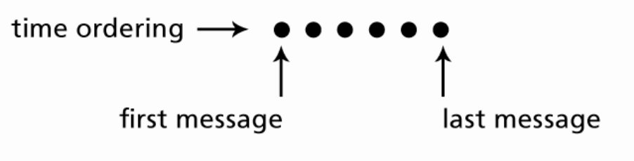
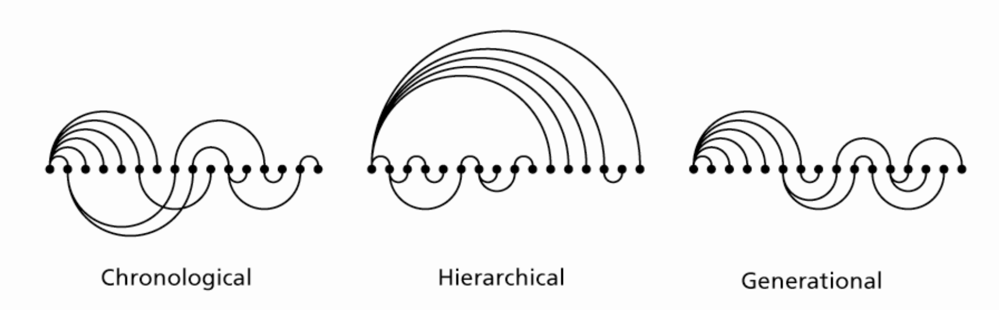
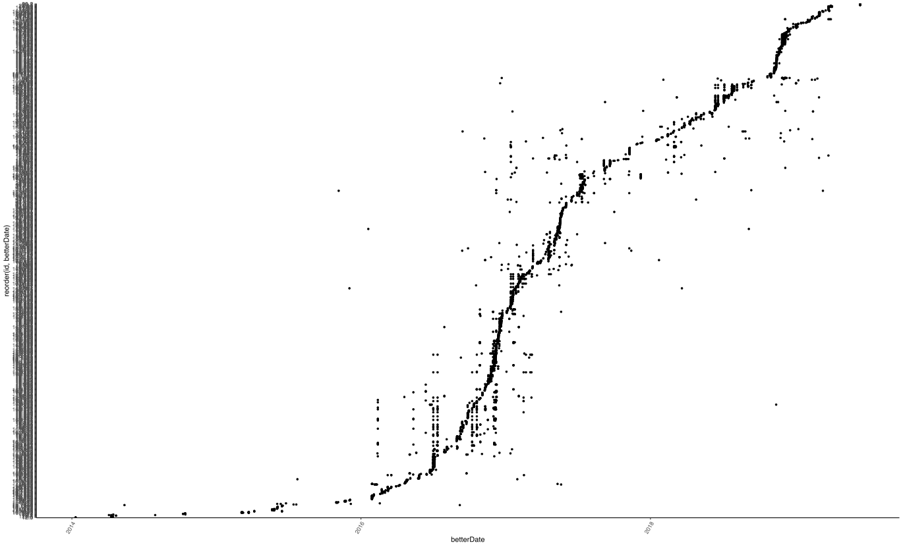
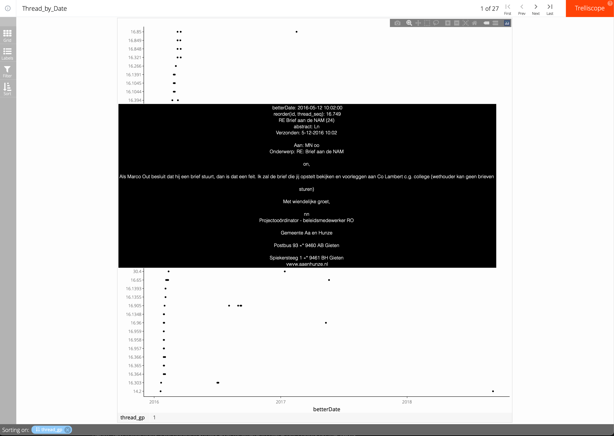
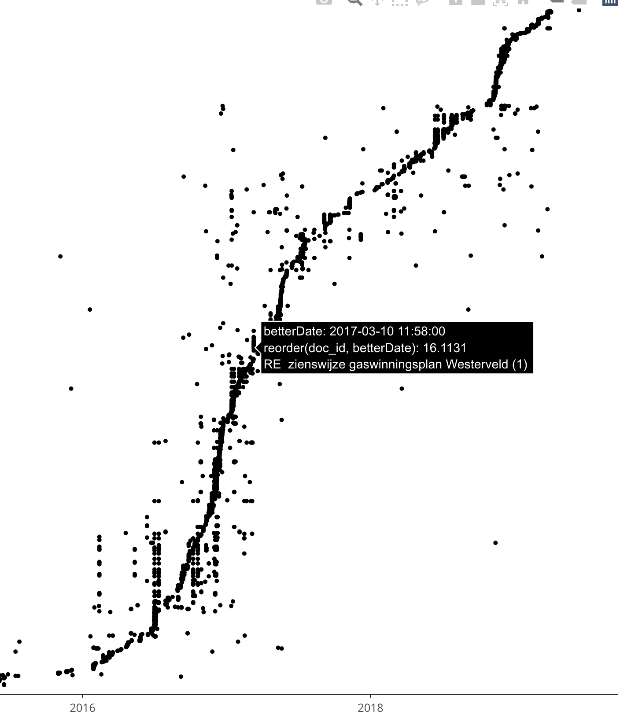

# data-preprocessing_toogoodtogo_threatlines
We're the hackathon leftovers, but we are Too Good To Go ;-). A repo by Lukas Schubotz, Stef van Buuren, and Raymon van Dinter. We aim to improve current data preprocessing for FTM's WOB data to analyze Shell and Dutch Governmental contacts.

## Synchronous visualisation of email threads

Publications from the FTM "Dossier SHELL papers" <https://www.ftm.nl/dossier/shell-papers> suggest that timing of events is critical in the interactions between actors. It would therefore be useful if we could visualise the mail exchanges in time.

The idea is to visualise threads of mail exchanges between actors over time. When this is done for multiple threads, the display would give rapid insight into the structure and timing of exchanges between actors. For example, suppose we are able to construct a single thread from "RE:" and "FW:" mails in the data. A simple visualisation would be 

See <https://citeseerx.ist.psu.edu/viewdoc/download?doi=10.1.1.88.9825&rep=rep1&type=pdf> for variations on this display, for example by adding the interactions between the actors by fancy arcs and resorting the mails according to actor pairs.

A generalisation to multiple simulataneous threads would stack multiple lines, similar to a dot plot. Such a design calls for relatively simple thread displays that are synchronised in time. Therefore we will concentrate on using a simple **thread line** that plots mail chronology against calender time. 

A somewhat grander idea would be to create a "film of events". The user would place a cursor on the time axis, and scroll through time. The new information per mail is displayed as the cursor passes the send time of the email. 

## Issues to resolve

We need complex/advanced text processing. Some of the issues include:

1. How can we split multiple emails in a RE/FW into a set of elementary mails, each corresponding to just one sender?
2. How well can we form threads by matching on subject lines?
3. Do duplicates extracted from RE/FW serve any useful purpose?
4. What is the percentage of threads for which we can find the parent mail (the mail that started the thread)?

## Data preprocessing
So for the data preprocessing step, we have based our work on Jelle Teijema's Notebook. However, we optimized some of the code, and provided some extensions. As additions, we added:
* emails that have been forwarded or replied are split into a new row for each email. The RE and FW, however, retain the original `doc_id`. The newest email gets a flag 1 for `is_novel`, while the original email gets a flag 1 for `is_threat_starter`.
* As RE and FW emails often contain an `Aan:` or `To:` tag, we can extract the `email_sender`.
* The RE and FW emails also often contain a `From:` or `Van:`, which we extracted to `email_retriever`.
* We added a feature to `betterDate`, where we extract the date from the content.
* An email often starts with an opening, like `Beste`, and a name. We extracted the names and placed them to `opening`.
* An email also often ends with a closing, like `Met vriendelijke groet`. We extracted these to `closing`.
* After removing this metadata, we end up with `formatted_abstract`.
* Persons oftentimes have the same ID or scrubbed name, where we can perform analysis on.

## Experiment 1

The first design plots all thread lines between 2016 and 2020 on one chart.

## Experiment 2

The second design uses `trelliscopejs` to plot the same information in smaller pieces, by the date of thread start.

The user can switch between 27 panes, each containing about 20 threads, and tooltips provide a quick assessment of the new information in the particular mail.

Try out the [interactive version](https://asreview-ftm-hackathon.github.io/data-preprocessing_toogoodtogo_threatlines/dotplot2/#display=Thread_by_Date&nrow=1&ncol=1&arr=row&pg=1&labels=thread_gp&sort=thread_gp;asc&filter=&sidebar=&fv=)

## Experiment 3

Back to figure 1, but now plotted with `rbokeh`, so that we may zoom and use tooltips (interaction not supported by GitHub markdown)

## Experiment 4

As figure 1, but with toolstips

